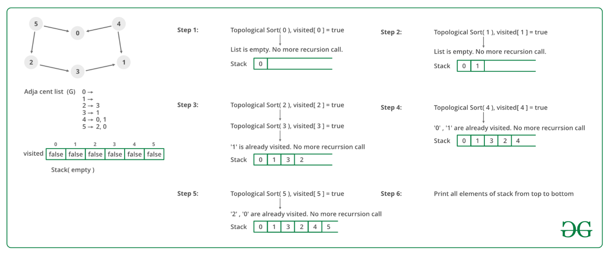

# Topological Sort

Topological sorting for Directed Acyclic Graph \(DAG\) is a linear ordering of vertices such that for every directed edge u v, vertex u comes before v in the ordering. Topological Sorting for a graph is not possible if the graph is not a DAG.

## DFS

In topological sorting, we use a temporary stack. We don’t print the vertex immediately, we first recursively call topological sorting for all its adjacent vertices, then push it to a stack. Finally, print contents of the stack. Note that a vertex is pushed to stack only when all of its adjacent vertices \(and their adjacent vertices and so on\) are already in the stack. 

 **Time Complexity:** O\(V+E\). 

## Kahn's

**A DAG G has at least one vertex with in-degree 0 and one vertex with out-degree 0**.  
 **Proof:** There’s a simple proof to the above fact is that a DAG does not contain a cycle which means that all paths will be of finite length. Now let S be the longest path from u\(source\) to v\(destination\). Since S is the longest path there can be no incoming edge to u and no outgoing edge from v, if this situation had occurred then S would not have been the longest path  
 =&gt; indegree\(u\) = 0 and outdegree\(v\) = 0

**Algorithm:** Steps involved in finding the topological ordering of a DAG:  
**Step-1:** Compute in-degree \(number of incoming edges\) for each of the vertex present in the DAG and initialize the count of visited nodes as 0.

**Step-2:** Pick all the vertices with in-degree as 0 and add them into a queue \(Enqueue operation\)

**Step-3:** Remove a vertex from the queue \(Dequeue operation\) and then.

1. Increment count of visited nodes by 1.
2. Decrease in-degree by 1 for all its neighboring nodes.
3. If in-degree of a neighboring nodes is reduced to zero, then add it to the queue.

**Step 5:** Repeat Step 3 until the queue is empty.

**Step 5:** If count of visited nodes is **not** equal to the number of nodes in the graph then the topological sort is not possible for the given graph.

